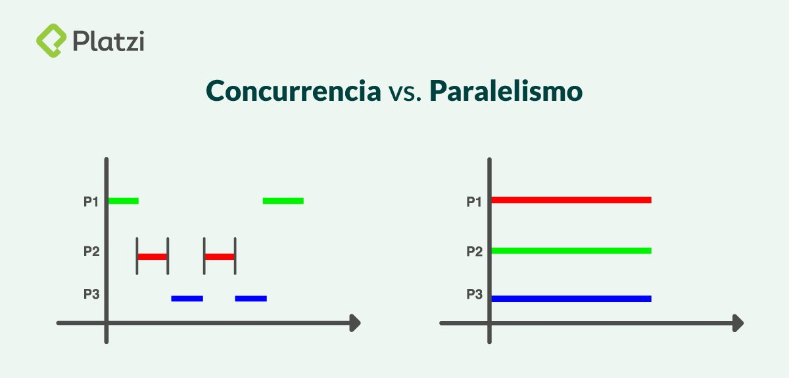

# API tipo REST

## Teoría

Has ahora hemos resuelto problemas usando un solo procesador, o hilo de ejecución. Sin embargo, en la práctica, los dispositivos móviles disponen de varios procesadores para ejecutar más de una tarea al mismo tiempo.

### Ejecución secuencial (temporal)

La ejecución secuencial consiste en la ejecución de varias tareas, una después de la otra, por un solo procesador.

Este tipo de ejecución no es viable en los sistemas de cómputo actuales. Imagínese que el procesador se ocupa de un solo proceso: pintar la pantalla. ¿A qué hora hace las demás tareas?

### Paralelismo

El paralelismo es la ejecución *simultánea* de varios procesos computacionales. Esto significa que se requieren varios medios de ejecución física: varios procesadores (o un procesador con varios núcleos) y la suficiente memoria para mantenerlos. Los procesos pueden estar relacionados entre ellos, para realizar una misma tarea, o no.

Se puede decir que el mundo real es paralelo: suceden muchas cosas al mismo tiempo, algunas relacionadas entre ellas, otras no.

Ejemplos de paralelismo:

* **Filarmónica**: Cada miembro del grupo toma un instrumento y se encarga de producir las notas correctas en el momento adecuado.
* **Partido de fútbol**: Cada jugador en el campo realiza una acción distinta, y se desplaza por el campo independiente de los demás.
* **Una clase de universidad**: Mientras un profesor habla, los alumnos toman nota. Cada uno lo hace de forma distinta e independiente, con su propio estilo y contenido para su posterior consulta.

### Concurrencia

La concurrencia es la capacidad de un solo procesador (físico) de procesar varios hilos al mismo tiempo. Para llevar esto a cabo, el procesador ejecuta un hilo por un tiempo determinado, y luego salta a un segundo hilo por otra fracción de tiempo. Después, vuelve a ejecutar el primer hilo, para repetir el ciclo.

El tiempo que permanece un procesador en un hilo depende de las prioridad del hilo: si dos hilos tienen la misma prioridad, entonces el tiempo que permanece en un hilo u otro es el mismo. Si uno de los hilos tiene más prioridad, entonces lo ejecutará por más tiempo. 

Un procesador físico puede encargarse de varios hilos de ejecución. Este número es determinado por el sistema operativo.

Ejemplos de concurrencia:

* **El gran maestro de ajedrez**: A un ajedrecista experto puede invirtarlo a competir contra 10 personas al mismo tiempo. El ajedrecista acepta y juega contra los 10 formados en círculo. El gran maestro debe establecer un orden para cada openente y, por lo menos en su mente, una manera de retomar cada juego cuando sea el turno.
* **Sistema operativo**: Un sistema operativo ejecuta muchas tareas relacionadas entre sí para lograr que un sistema de hardware sea usable para los humanos, por ejemplo: leer entrada del ratón y el teclado, mostrar el resultado de los procesos en pantallas, ejecutar el reloj, ejecutar XCode, servicios de red, etc. Aunque los computadores actuales tienen varios procesdores, el número de tareas con las que un sistema opertivo trata al mismo tiempo es muy superior.

### Grand Central Dispatch

El Grand Central Dispatch (GCD) es una herramienta de swift que facilita el manejo de tareas concurrentes.

### Cola

Una cola es una estructura lineal que sigue el orden "Primero Adentro, Primero Fuera" (First In First Out - FIFO). El GCD tiene dos tipos de cola: una en serie y otra concurrente.

#### Cola en Serie (Serial Queue)

En una cola en serie, solo se corre una tarea al tiempo. Una vez que la tarea termina, arranca la segunda tarea. Las tareas son ejecutadas en el orden que se estipula dentro de la cola.

#### Cola Concurrente (Concurrent Queue)

En una cola concurrente, varias tareas pueden ser ejecutadas al mismo tiempo. El comienzo de una tarea será el orden que se les haya dado, es decir: la tarea 1 arranca antes que la tarea 2; sin embargo, como todas las tareas se ejecutan al mismo tiempo, las tareas pueden terminar en cualquier orden. Por ejemplo: la tarea 2 podría terminar antes que la tarea 1.

### Síncrono vs Asíncrono

Hay dos maneras de despachar tareas usando GCD: Una es síncrona (en serie) y la otra es asíncrona (concurrente).

La ejecución síncrona retorna el control al hilo principal cuando la tarea del GCD se haya completado. De eseta manera, la función que hace el llamado síncrono tendrá que esperar hasta que la ejecución del GCD haya temrinado para que pueda continuar con su ejecución.

La ejecución asíncrona retorna el control inmediatamente, es decir, no se bloquea el hilo de ejecución. Esto significa que el hilo principal no espera a que termine la ejecución del GCD.

https://www.swiftdevcenter.com/grand-central-dispatch-tutorial-swift-5/

## Ejercicios
